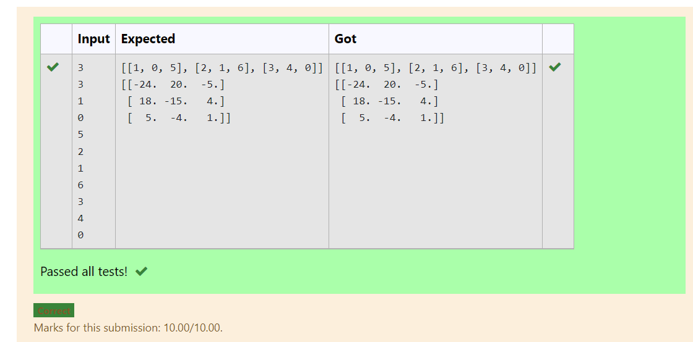

# Inverse-of-matrix

## AIM:
To find the inverse of matrix using numpy

## ALGORITHM:
Step 1:
Import Numpy as np.

Step 2:
Get input from the user.

Step 3:
Create empty lists l1 and l2.

Step 4:
Use for loop to append the values into the list created.

Step 5:
Print the product of two arrays.

## PROGRAM:
import numpy as np
l1,l2=[],[]
n1,n2=int(input()),int(input())
for i in range(n1):
    for j in range(n2):
        values=int(input())
        l1.append(values)
    l2.append(l1)
    l1=[]
print(l2)
a=np.linalg.inv(l2)
print(a)

## OUTPUT:

## RESULT:
Thus,inverse of a matrix is done using numpy
